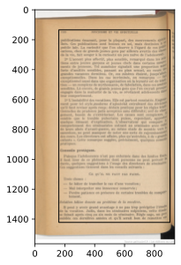

# Background

Automagic image processing is very hard. There are some [good
libraries](https://gitlab.gnome.org/World/OpenPaperwork/libpillowfight) out
there to play with. Gallica-Autobib very deliberately does *not* strive for a
general solution to the scanned image problem.

This problem can be broken down into several parts:

1. Identifying the region of the scan which contains the page.
2. Identifying the region of the page which contains the content.
3. Dewarping, deskewing, deblurring etc. the content region.
4. Transforming the content region to coerce it into the desired output format
   (posterizing, thresholding, etc).

The steps do not have to be done in this order, although this is the order in
which we do them. Additionally there is an implied crop between 3 and 4, but
cropping is the least of our problems.

If you have a bunch of generic scans to process, I recommend you stop reading
and use something like
[scantailor](https://github.com/4lex4/scantailor-advanced) to do it in batch
mode. You might like to use a [set of
scripts](https://2e0byo.gitlab.io/post/coding/cleaning-scanned-pdfs/) I
developed to automate as much as possible.

# Cropping to content

Gallica makes our life slightly easier:

- Almost all scans are OCRd.
- OCR data contains a "content box". We can get this straight from the server,
  in xml (ugh).
- Scans are in general of very high quality.

Initially I thought we could just take the content box and have done with it.
Unfortunately that doesn't work: the OCR seems to be set up not to pick up page
number.  So we can reduce the problem to the following:

- Look for a single line of text outside the content box.

This implies the ability to distinguish between lines of text and the edge of
the page or any other noise the scan might have.  After playing a bit with
matplotlib the easiest way was just to take the mean of each row, differentiate
it, and then detect the rapid changes in gradient which happen with a line of
text.

## The line detection algorithm

We start with Gallica's content box, extracted from the OCR endpoint:

{ loading=lazy }

We grayscale it, take the mean of every row and then take the first differential
of that mean:

{ loading=lazy }

That differential is very useful since it gives us a distinctive signature for a
line: a large spike in one direction followed by a large spike in the other,
i.e. white-to-black followed by black-to-white.

We look 1.5 standard deviations away from the mean of the differential:

{ loading=lazy }

And now we can easily find a line of text.  But we might still mistakenly detect
the edge of the page.  So we define a search region:

{ loading=lazy }

This region is arbitrarily sized as 5% the height of the page either side of the
text box.  We then go through the region either side, backwards from the
textbox.  Going up we look for a positive and then a negative peak, going down
we look for a negative then a positive peak.  Thus we end up with:

{ loading=lazy }

And then we grow the region manually to:

{loading=lazy}

Which is pretty decent.  The script which produced this can be found in the
repository as `test_image_processing.py`.

## The crude algorithm

We have another algorithm which tries to crop to the *content* if given the
*page*.  It can fail if given the *scan*, as the edges of the page confuse it.
This algorithm:

- grayscales the image
- autocontrasts it
- thresholds it aggressively
- returns the bounding box of black on the page

This crop data can then be applied to the original image.  Since we have two
means of getting crop data, and the OCR method is pretty reliable (assuming
Gallica's OCR coverage is extensive enough) we compare the two and raise an
exception if the difference is too great.  Depending on the mode this will
either trigger manual intervention to select between the two regions, cause both
to be added to the PDF for later processing, or stop execution.

# Processing

Processing is distinct from cropping.  Since there is no easy way to replace in
an image in a pdf whilst leaving the text intact, processing the image (beyond
cropping) implies losing Gallica's ocrd text.  If you want *both* a nicely
processed pdf for printing *and* a cropped, OCRd pdf for screen usage, run
Gallica-Autobib twice, the first time with `--no-clean`.  Caching will prevent
it doing anything except reprocessing (unless there were unsuccessful matches).

Processing consists in:

- cropping to content
- autocontrasting
- posterizing to reduce the problem domain
- filtering with a crude skewing filter
- autocontrasting again

The 'crude skewing filter' is a slightly nicer version of thresholding.  It
multiplies values above a threshold by a multiplier, and divides those below a
threshold by a divisor.  Since the resulting data is rounded, this lets us
squash the upper and lower ranges by different amounts, whilst still sending the
image massively in the direction of a binary image.

There is a good deal of scope for improvement with this algorithm: it was chosen
because it is quick and easy.
